 #Indecisio
 
 ##Table of Contents
  1. [Summary](#Summary)
  2. [Contributors](#Contributors)
  3. [Links](#Links)
  4. [Screenshots](#screenshots)
  5. [Technologies](##technologies-used)
  6. [Set Up](#Set-up)  
   
 ##Summary
 An app built to provide a space for users to receive random  suggestions for activities as well as share their own.
 Users have the option of drawing activities from a global pool generated by all users, 
 or they can limit the possibilities to activities that they previously submitted themselves. In addition, the user can also limit the possible
 results to fit within a specific category such as learning, fitness, entertainment, chores, or socialize.
 
##Authors

   - [Taylor Bradshaw](https://github.com/stronghearth)
   - [Blade Boles](https://github.com/BladeBoles)
   - [William MacNeil ](https://github.com/bilbertius) 
    
##Links    
   
   [Live App](https://indecisio.now.sh/) 
   
   [Client Repo](https://github.com/thinkful-ei-jaguar/indecisio-client)
   
   [Server Repo](https://github.com/thinkful-ei-jaguar/indecisio-server)
   
##Technologies Used 
 - React | v16.13.1
 - Express | v4.17.1
 - Knex  | v0.20.13
 - Postgresql | v12.0.1
 
 ##ScreenShots
   
   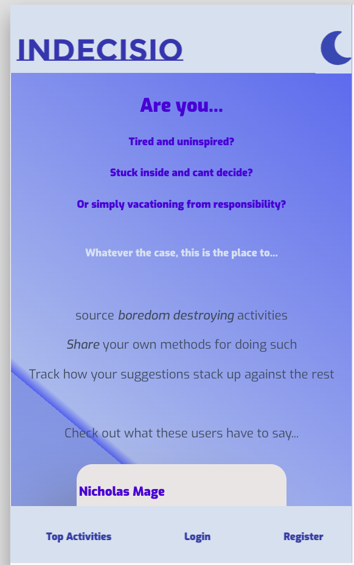 
  
   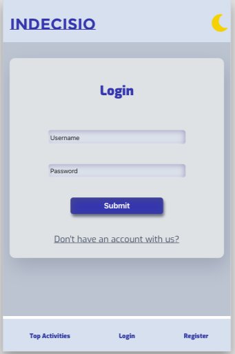 
      
   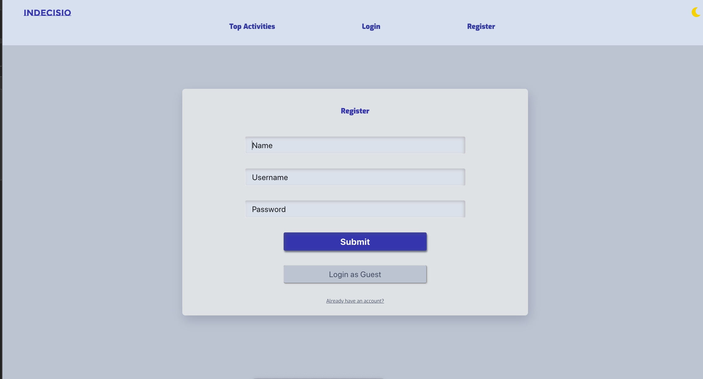 
     
   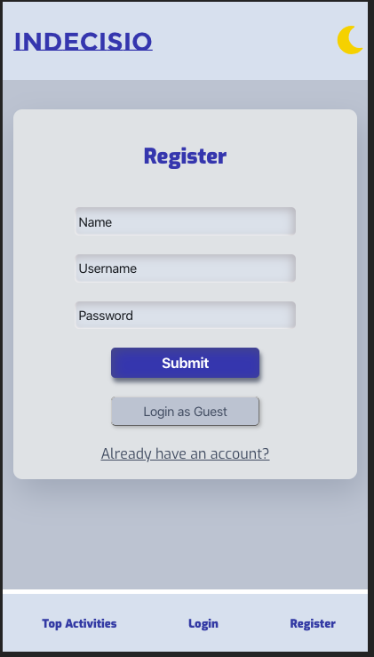 
      
   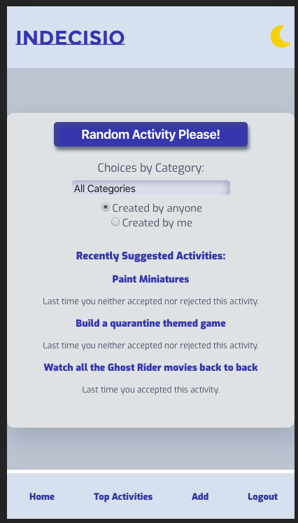 
     
   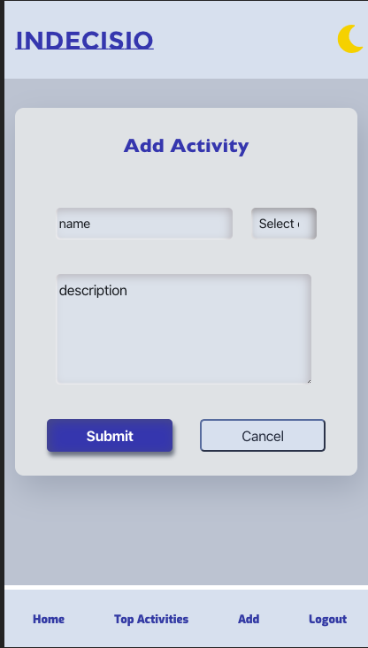 
     
   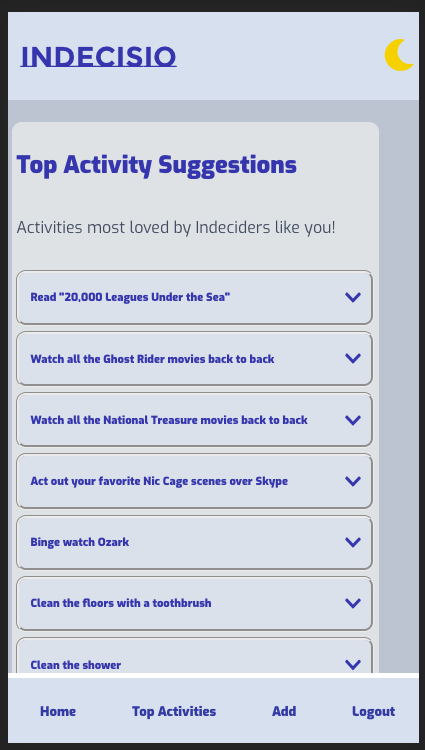 
      
   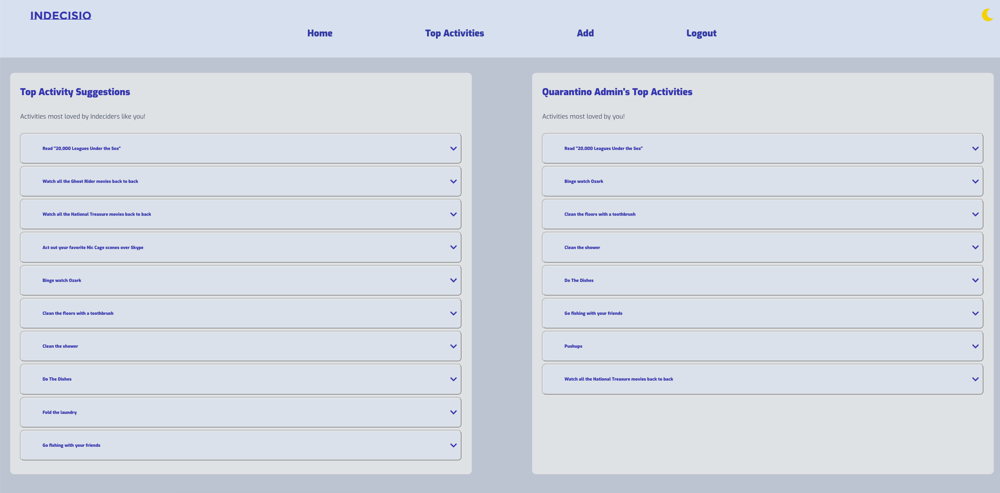 
      
   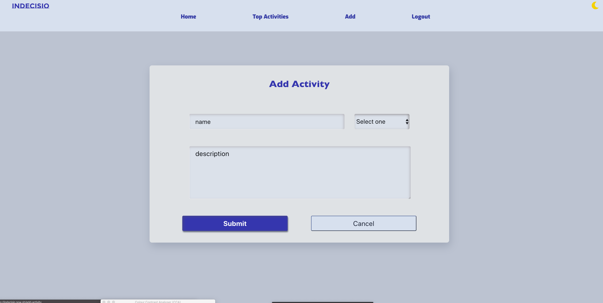 
      
   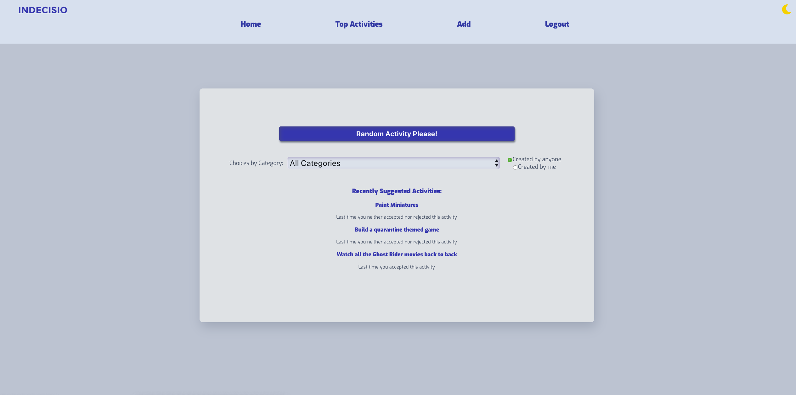 
     
   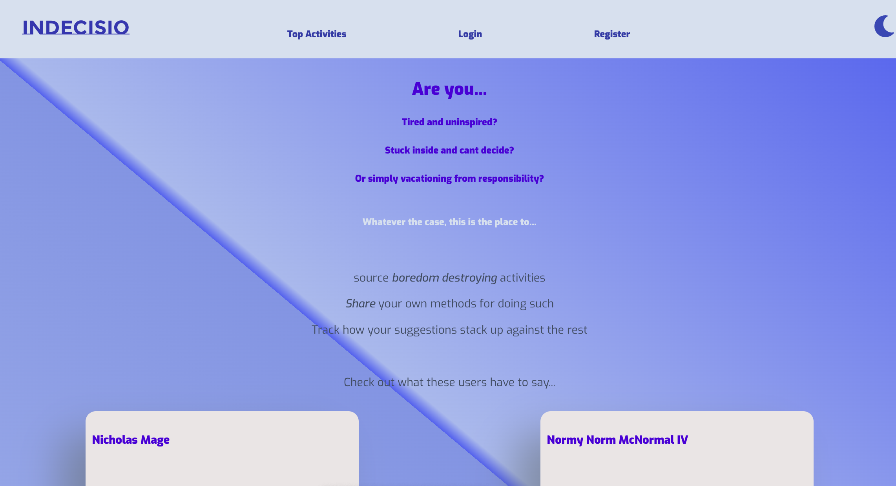 
   
   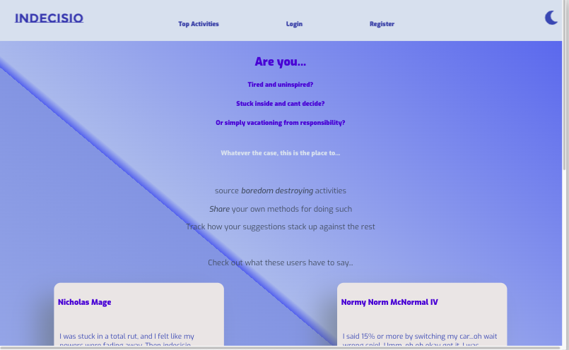 
   
    

This project was bootstrapped with [Create React App](https://github.com/facebook/create-react-app).
